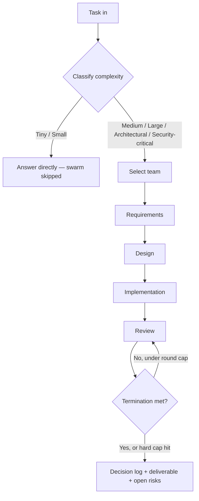

<p align="center">
  
</p>

<p align="center">
  
  
  
  
</p>

<p align="center"><b>Six engineers who genuinely disagree with each other, arguing inside a single Claude Code session — so the disagreement happens before your code ships, not after.</b></p>

---

## 🔥 What this actually is

Most "multi-agent persona" prompts are theater: ask Claude to be five different people
and it gives you one opinion in five voices, because nothing forces the personas to
actually disagree. Swarm is not that.

Swarm is a **Claude Code Skill** — a structured state machine, not a roleplay script —
that runs your task through a small team of roles with **genuinely conflicting
objectives** (the Product Manager wants scope small, the Architect wants it durable, the
Security Engineer can block everyone else, and nobody gets a vote — the Tech Lead
arbitrates). Each role forms its position **in isolation** before seeing anyone else's,
every role is **required to produce a concrete objection** before a phase can close, and
the whole run is bounded by hard stop conditions so it can't spiral.

It's built from a synthesis of 90+ sources on multi-agent LLM reasoning, code review
effectiveness, and agent failure modes — not vibes. See [`docs/failure-modes.md`](docs/failure-modes.md)
for the specific things this design prevents, and why generic "consider multiple
perspectives" prompting doesn't.

## 🧠 Why structure beats personas

| Without structure | With Swarm |
|---|---|
| All roles see the same context → converge on the same answer instantly | Independent analysis first — each role commits to a position before seeing the others' |
| "Please consider security too" → generic, easy to skip | Security Engineer has a **binding veto** on critical findings — only overridable by an explicit, logged Tech Lead risk-acceptance |
| Roles politely agree with whoever spoke first | **Mandatory disagreement** — every role must raise a concrete objection or explicitly justify having none |
| Debate runs until it "feels" done | Hard round caps + a verifiable AND-condition on findings — see [Termination](#-termination-not-vibes) |
| You get an answer | You get an answer **and** a decision log showing what was rejected, by whom, and why |

## 👥 The team

| Role | Optimizes for | Can veto | Conflicts with |
|---|---|---|---|
| 📋 **Product Manager** | User value, scope, timeline | Scope creep | Architect, Security (proportionality) |
| 🏛️ **Architect** | Maintainability, long-term cost | Structural debt | PM (over-scoping), Developer (over-simplifying) |
| 💻 **Developer** | Correct, simple implementation | Non-implementable designs | Architect, QA, Security (rework cost) |
| 🔍 **QA Engineer** | Edge cases, regressions | Untested critical paths | Developer (scope of testing) |
| 🛡️ **Security Engineer** | Vulnerability prevention | **Critical findings — absolute** | Everyone (friction vs. real risk) |
| ⚖️ **Tech Lead** | The right trade-off | Arbitrates all of the above | Nobody — arbitrates, never argues its own stake |

Full role definitions with their independent-analysis checklists live in [`roles/`](roles/).

## ⚙️ How a run actually flows



Every phase runs the same inner loop: **independent analysis → cross-exposure →
structured debate → mandatory disagreement check → Tech Lead arbitration**. Full
mechanics per phase are in [`workflows/`](workflows/); the routing table that decides
team size and round caps by task complexity is in [`SKILL.md`](SKILL.md).

## 🛑 Termination — not vibes

```
STOP WHEN:
  requirements confirmed AND
  architecture approved   AND
  implementation complete AND
  qa_findings has 0 unresolved blockers AND
  security_findings has 0 unresolved blockers
  OR iteration_count >= 8
  OR ~10 minutes of wall-clock work elapsed
```

If a hard cap hits before the real condition is met, Swarm says so explicitly and
hands you the open items — it never silently keeps debating, and never silently
pretends everything resolved cleanly. Details in [`SKILL.md`](SKILL.md) Step 4.

## 📦 Install

Swarm is a Claude Code Skill — plain markdown, no build step, no dependencies.

**Option A — clone into your skills directory:**
```bash
git clone https://github.com/Nishchay-Bhudia/swarm.git ~/.claude/skills/swarm
```

**Option B — drop it into a single project:**
```bash
git clone https://github.com/Nishchay-Bhudia/swarm.git .claude/skills/swarm
```

Claude Code picks up skills from `~/.claude/skills/` (all projects) or
`.claude/skills/` (this project only) automatically — no registration step. Restart
your session if it was already open.